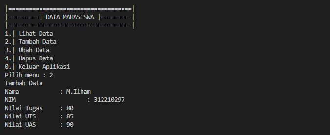
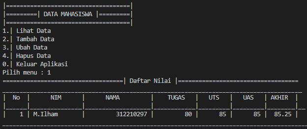
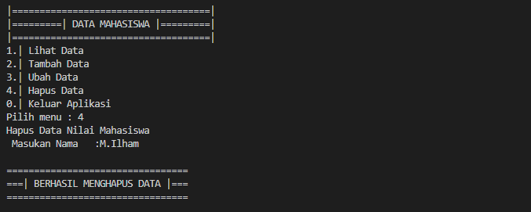
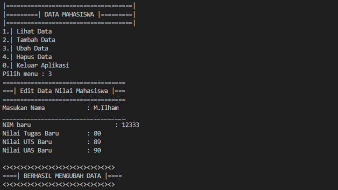
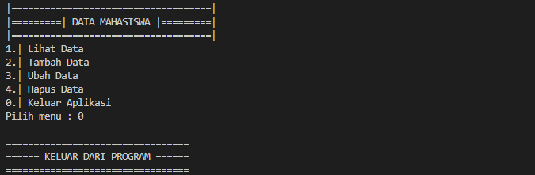

# Pertemuan 11 (Praktikum 6)

### Tugas Praktikum
#### Buat program sederhana dengan mengaplikasikan penggunaan fungsi yang akan menampilkan daftar nilai mahasiswa, dengan ketentuan :
- fungsi **tambah()** untuk menambahkan data
- fungsi **tampilkan()** untuk menampilkan data
- fungsi **hapus(nama)** untuk menghapus data berdasarkan nama
- fungsi **ubah(nama)** untuk mengubah data berdasarkan nama

#### Daftar Nilai Mahasiswa Menggunakan fungsi
- Pertama yang dilakukan adalah membuat sebuah dictionary kosong 
```
data = {}
```
- Lalu kita akan menampilkan data mahasiswa menggunakan fungsi
#### Fungsi Tambah() Untuk Menambahkan Data
```
def tambah(*t):
    print("Tambah Data")
    nama = input("Nama           : ")
    nim = int(input("NIM            : "))
    uts = int(input("Nilai UTS      : "))
    uas = int(input("Nilai UAS      : "))
    tugas = int(input("Nilai Tugas    : "))
    akhir = tugas*30/100 + uts*35/100 + uas*35/100
    data[nama] = nim, uts, uas, tugas, akhir
```
- Berikut Tamplian Tambah Data

#### Fungsi Tampilkan() Untuk Menampilkan Data
```
def tampilkan(*l):
    if data.items():
        print("="*78)
        print("|                               Daftar Mahasiswa                             |")
        print("="*78)
        print("|No. | Nama            |       NIM       |  UTS  |  UAS  |  Tugas  |  Akhir  |")
        print("="*78)
        i = 0
        for z in data.items():
            i += 1
            print("| {no:2d} | {0:15s} | {1:15d} | {2:5d} | {3:5d} | {4:7d} | {5:7.2f} |"
                    .format(z[0][:13], z[1][0], z[1][1], z[1][2], z[1][3], z[1][4], no=i))
        print("=" * 78)
    else:
        print("="*78)
        print("|                               Daftar Mahasiswa                             |")
        print("="*78)
        print("|No. | Nama            |       NIM       |  UTS  |  UAS  |  Tugas  |  Akhir  |")
        print("="*78)
        print("|                                TIDAK ADA DATA                              |")
        print("="*78)
```
- Berikut Tampilan Tampilkan Data


#### Fungsi Hapus(nama) Untuk Menghapus Data Bedasarkan Nama
```
def hapus(*nama):
    print("Hapus Data")
    nama = input("Masukkan Nama  : ")
    if nama in data.keys():
        del data[nama]
    else:
        print("Nama {0} Tidak Ditemukan".format(nama))
```
- Berikut Tampilan Hapus(nama)


#### Fungsi Ubah(nama) Untuk Mengubah Data Bedasarkan Nama
```
def ubah(*nama):
    print("Ubah Data")
    nama = input("Masukkan Nama  : ")
    if nama in data.keys():
        nim = int(input("NIM            : "))
        uts = int(input("Nilai UTS      : "))
        uas = int(input("Nilai UAS      : "))
        tugas = int(input("Nilai Tugas    : "))
        akhir = tugas * 30 / 100 + uts * 35 / 100 + uas * 35 / 100
        data[nama] = nim, uts, uas, tugas, akhir
    else:
        print("Nama {0} tidak ditemukan".format(nama))
  ```
  - Berikut Tampilan Ubah(nama)
  

- Tampilan Saat Keluar Dari Program

